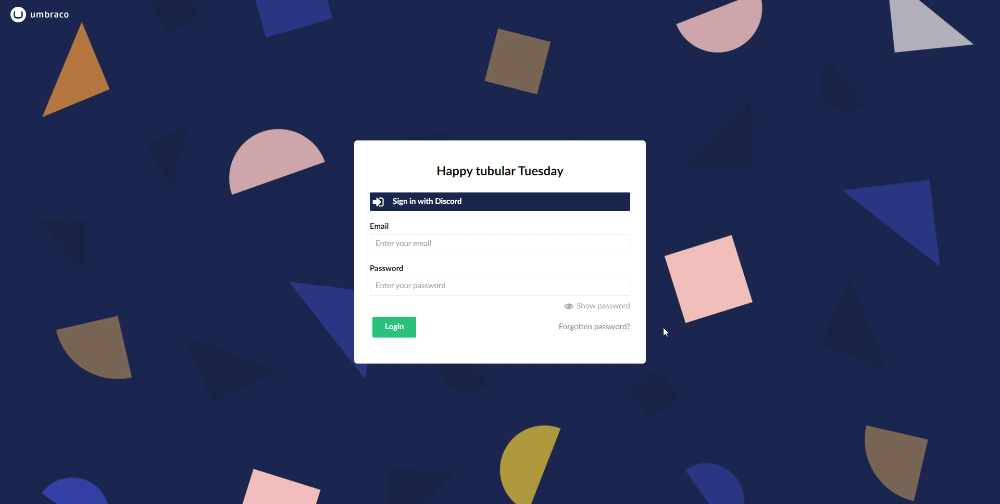

# Umbraco backoffice - Discord single sign on

An umbraco solution that uses Discord's oAuth2 as backoffice user logins. It autolinks user and allows them to be created in the backoffice (and approves them) if they are a part of the Umbraco Discord server: https://discord.gg/umbraco


## Acknowledgements

- [Paul Seal's clean starter kit](https://github.com/prjseal/Clean-Starter-Kit-for-Umbraco-v9)
- [AspNet.Security.OAuth.Providers Package](https://github.com/aspnet-contrib/AspNet.Security.OAuth.Providers)

## Demo



## Installation
In the `UmbracoBuilderExtensions.cs` file, you'll need to add your own Discord client ID and secret:

You can get them from visiting https://discord.com/developers and creating a new application.

```csharp
private static void BuildDiscord(BackOfficeAuthenticationBuilder backOfficeAuthenticationBuilder)
{
    backOfficeAuthenticationBuilder.AddDiscord(
        backOfficeAuthenticationBuilder.SchemeForBackOffice(ApplicationConstants.DiscordLoginProviderName),
        options =>
        {
            options.ClientId = "YourDiscordClientId";
            options.ClientSecret = "YourDiscordSecret";
        
            // we need to save these tokens so we can access them to make requests against discord api
            options.SaveTokens = true;

            options.Scope.Add("email");
            options.Scope.Add("guilds");
        });
}
```
